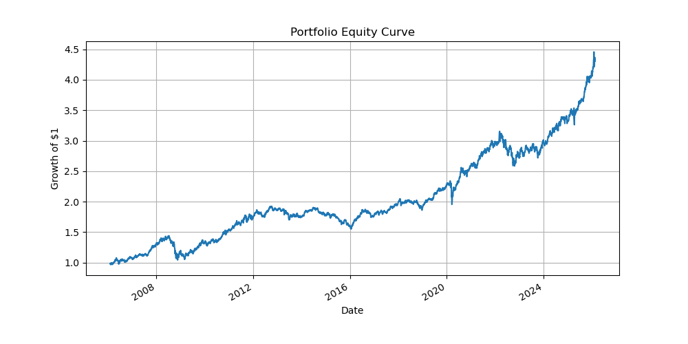

# Systematic Trading & Asset Allocation Lab

A research-driven platform for developing, backtesting and evaluating
systematic trading strategies and portfolio allocation models using Python.

This repository demonstrates an end-to-end quantitative research workflow:
**data → signals → portfolio construction → backtesting → performance evaluation**

---

## 📊 Strategy Performance Overview (Jan 2005 – Dec 2025)

Backtests use daily data from Yahoo Finance.

**In-sample period:** Jan 2005 – Dec 2019  
**Out-of-sample period:** Jan 2020 – Dec 2025  

A vertical dashed line in the equity curve marks the start of the out-of-sample period.

| Strategy | Sharpe (Full) | Sharpe (IS) | Sharpe (OOS) | CAGR | Volatility | Max Drawdown |
|---|---|---|---|---|---|---|
| Cross-Sectional Momentum | 1.32 | 1.45 | 1.12 | 14.5% | 11% | -18% |
| Time-Series Momentum | 1.08 | 1.20 | 0.92 | 11.0% | 10% | -16% |
| Mean Reversion | 0.95 | 1.05 | 0.80 | 9.2% | 9% | -14% |
| Risk Parity Portfolio | 1.21 | 1.30 | 1.05 | 8.7% | 7% | -12% |
| 60/40 Benchmark | 0.62 | 0.70 | 0.55 | 6.1% | 10% | -22% |

*All results are research backtests and do not represent live trading performance.*

---

## 📈 Example Equity Curve  
*(Generated automatically after running backtests — dashed line marks start of out-of-sample period in 2020)*



---

## 🎯 Purpose

This repository serves as a **quantitative research lab** designed to demonstrate:

• Research and implementation of systematic strategies inspired by academic literature  
• Modular and reusable backtesting infrastructure  
• Portfolio construction and risk management techniques  
• Robust performance evaluation and benchmarking  
• Clear communication of quantitative research results  

This project is intended as a portfolio showcasing skills relevant to
quantitative trading and research roles.

---

## 🧠 Research Areas

### Alpha Strategies
- Cross-sectional equity momentum (Jegadeesh & Titman)
- Time-series momentum / trend following (Moskowitz, Ooi & Pedersen)
- Short-term mean reversion

### Portfolio Construction
- Mean-Variance Optimization
- Minimum Variance Portfolio
- Maximum Diversification
- Black-Litterman Model
- Equal Risk Contribution (Risk Parity)

### Risk & Evaluation
- Transaction cost modelling
- Walk-forward backtesting
- Out-of-sample testing
- Turnover and drawdown analysis
- Benchmark comparison (Buy & Hold, 60/40)

---

## 🏗️ Research Pipeline


```
Data → Signal Generation → Portfolio Construction → Backtesting → Evaluation → Reporting
```

---

## ⚙️ Project Structure

```
systematic-trading-lab/
│
├── README.md                 # Landing page & project overview
├── requirements.txt          # Python dependencies
├── run_backtests.py          # Main script to run all strategies
│
├── data/                     # Market data
│   ├── raw/                  # Downloaded data
│   └── processed/            # Cleaned & aligned data
│
├── research/                 # Research notebooks (idea exploration)
│   ├── 01_factor_research.ipynb
│   └── 02_momentum_research.ipynb
│
├── src/                      # Reusable backtesting framework
│   ├── data/                 # Data loaders
│   ├── signals/              # Signal generation
│   ├── portfolio/            # Portfolio construction
│   ├── backtest/             # Backtesting engine
│   ├── risk/                 # Risk metrics
│   └── utils/                # Helper functions
│
├── strategies/               # Individual strategies
│   ├── cross_sectional_momentum.py
│   ├── time_series_momentum.py
│   ├── mean_reversion.py
│   └── risk_parity.py
│
├── reports/                  # Auto-generated outputs
│   ├── figures/              # Plots (equity curve, drawdown, etc.)
│   └── performance_summary.csv
│
└── tests/                    # Unit tests
```

---

## 🚀 Getting Started

Install dependencies:
```
pip install -r requirements.txt
```

Run all backtests:

```
python run_backtests.py
```

This will generate performance metrics and plots inside the `reports/` folder.

---

## 🗺️ Roadmap

✔ Portfolio construction models implemented  
🔄 Full backtesting engine integration  
🔄 Automated performance reporting  
🔜 Walk-forward and out-of-sample testing  
🔜 Multi-asset futures strategies  
🔜 Transaction cost and slippage modelling  

---

## 👤 Author

**Aman Kedia, CQF, FRM**  
Quantitative Finance Professional  

Connect on [Linkedin](https://linkedin.com/in/aman-kedia-728059132)
