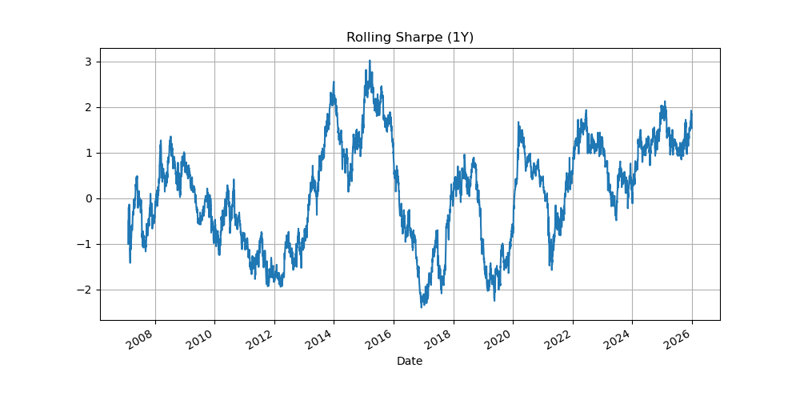
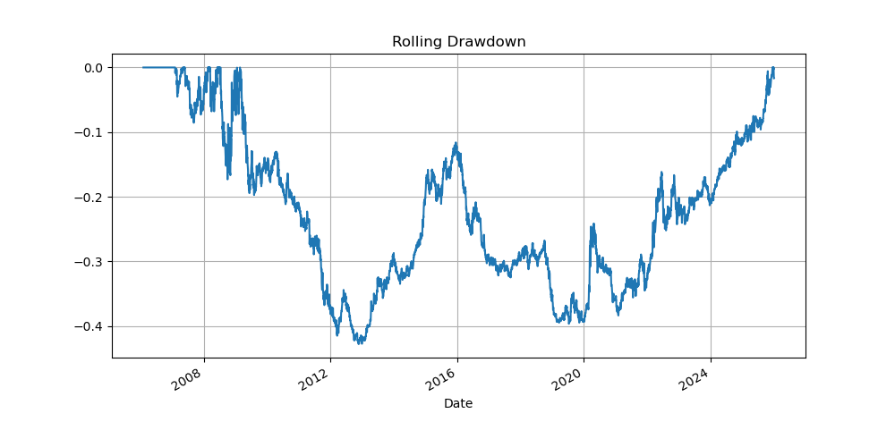
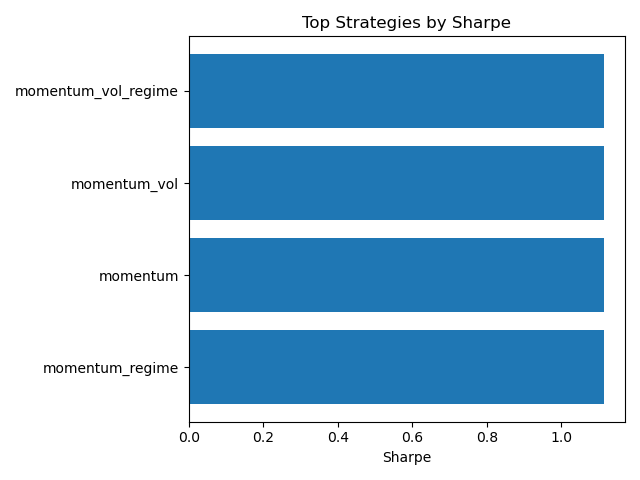
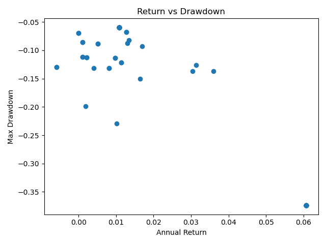

# Systematic Trading & Asset Allocation Lab

A research-driven platform for developing, backtesting and evaluating
systematic trading strategies and portfolio allocation models using Python.

This repository demonstrates an end-to-end quantitative research workflow:

**Data → Signals → Portfolio Construction → Backtesting → Evaluation → Research**

The goal of this project is to demonstrate the type of systematic research
infrastructure used in quantitative trading and portfolio management.

---

## 📊 Strategy Leaderboard

<!-- LEADERBOARD_START -->
Leaderboard will appear here after running research.
<!-- LEADERBOARD_END -->

---

### Example Strategy Performance

*(Charts generated automatically from research results)*

### Equity Curve


### Rolling Sharpe Ratio



### Rolling Drawdown



---

## Research Results

### Top Strategies



### Return vs Drawdown



---

## 🎯 Purpose

This repository serves as a **quantitative research lab** designed to demonstrate:

• Research and implementation of systematic strategies inspired by academic literature  
• Modular and reusable backtesting infrastructure  
• Portfolio construction and risk management techniques  
• Robust performance evaluation and benchmarking  
• Clear communication of quantitative research results  

This project is intended as a portfolio showcasing skills relevant to
quantitative trading and research roles.

---

## 🧠 Research Areas

### Alpha Strategies
- Cross-sectional equity momentum (Jegadeesh & Titman)
- Time-series momentum / trend following (Moskowitz, Ooi & Pedersen)
- Short-term mean reversion

### Portfolio Construction
- Mean-Variance Optimization
- Minimum Variance Portfolio
- Maximum Diversification
- Black-Litterman Model
- Equal Risk Contribution (Risk Parity)

### Risk & Evaluation
- Transaction cost modelling
- Walk-forward backtesting
- Out-of-sample testing
- Turnover and drawdown analysis
- Benchmark comparison (Buy & Hold, 60/40)

---

## 🏗️ Research Pipeline


```
Data → Signal Generation → Portfolio Construction → Backtesting → Evaluation → Reporting
```

---

## ⚙️ Project Structure

```
systematic-trading-lab/
│
├── README.md                 # Landing page & project overview
├── requirements.txt          # Python dependencies
├── run_backtests.py          # Main script to run all strategies
│
├── data/                     # Market data
│   ├── raw/                  # Downloaded data
│   └── processed/            # Cleaned & aligned data
│
├── research/                 # Research notebooks (idea exploration)
│   ├── 01_factor_research.ipynb
│   └── 02_momentum_research.ipynb
│
├── src/                      # Reusable backtesting framework
│   ├── data/                 # Data loaders
│   ├── signals/              # Signal generation
│   ├── portfolio/            # Portfolio construction
│   ├── backtest/             # Backtesting engine
│   ├── risk/                 # Risk metrics
│   └── utils/                # Helper functions
│
├── strategies/               # Individual strategies
│   ├── cross_sectional_momentum.py
│   ├── time_series_momentum.py
│   ├── mean_reversion.py
│   └── risk_parity.py
│
├── reports/                  # Auto-generated outputs
│   ├── figures/              # Plots (equity curve, drawdown, etc.)
│   └── performance_summary.csv
│
└── tests/                    # Unit tests
```

---

## 🚀 Getting Started

Install dependencies:
```
pip install -r requirements.txt
```

Run all backtests:

```
python run_backtests.py
```

This will generate performance metrics and plots inside the `reports/` folder.

---

## 🗺️ Roadmap

✔ Portfolio construction models implemented  
🔄 Full backtesting engine integration  
🔄 Automated performance reporting  
🔜 Walk-forward and out-of-sample testing  
🔜 Multi-asset futures strategies  
🔜 Transaction cost and slippage modelling  

---

## 👤 Author

**Aman Kedia, CQF, FRM**  
Quantitative Finance Professional  

Connect on [Linkedin](https://linkedin.com/in/aman-kedia-728059132)
